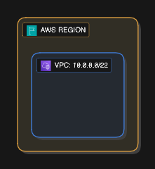

## LAB 11: VPC

### Langkah 1: Pergi ke "VPC" Dashboard

1. Taipkan "VPC" di search bar AWS
2. Favorite-kan "VPC" untuk mudah akses
3. Click ikon "VPC" untuk dibawa ke dashboard "VPC"

### Langkah 2: Buat VPC baru

1. Click "Create VPC" dan isikan name: `my-vpc`
2. Pastikan option "VPC only"
3. Isikan IPv4 CIDR block dengan nilai ini: `10.0.0.0/22`
