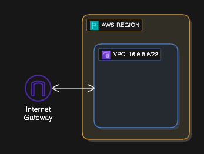

## LAB 12: Internet Gateway

### Langkah 1: Buat Internet Gateway

1. Pergi ke "Internet Gateway" dalam dashboard VPC
2. Click "Create internet gateway" dan isikan nama: `my-igw`
3. Click "Attach VPC" dan pilih VPC anda

### Langkah 2: Sahkan di VPC Resource Map

1. Click "Your VPC" dan pilih VPC anda: `my-vpc`
2. Rujuk "Resource Map" dan lihat jika ada sambungan ke Internet Gateway
3. Anda akan dapati tiada kerana kita belum setup Route Table
