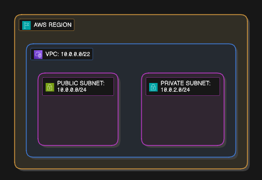

## LAB 12: Create Subnet

### Langkah 1: Buat Public Subnet

1. Pergi ke "Subnet" dalam dashboard VPC
2. Click "Create Subnet" dan isikan nama: `public-subnet`
3. Pastikan pilih VPC yang anda buat sebelum ni (bukan VPC default)
4. Pilih Availability Zone (ap-southeast-1a)
5. Isikan IPv4 CIDR block dengan nilai ini: `10.0.0.0/24`

### Langkah 2: Buat Private Subnet

1. Click "Create Subnet" dan isikan nama: `private-subnet`
2. Pastikan pilih VPC yang anda buat sebelum ni (bukan VPC default)
3. Pilih Availability Zone (ap-southeast-1a)
4. Isikan IPv4 CIDR block dengan nilai ini: `10.0.2.0/24`

### Langkah 3: Sahkan di VPC Resource Map

1. Click "Your VPC" dan pilih VPC yang anda: `my-vpc`
2. Rujuk "Resource Map" dan pastikan ia mengandungi dua subnet anda
