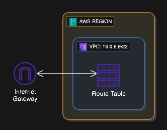

## LAB 13: Route Table

### Langkah 1: Edit Route

1. Click "Route Table" anda dalam "Resource Map" VPC: `my-vpc`
2. Click "Edit Route" dan "Add Route"
3. Letakkan destination: `0.0.0.0/0` dan target `Internet Gateway`
4. Pilih `my-igw` sebagai target dan Click "Save changes"

### Langkah 2: Sahkan di VPC Resource Map

1. Click "Your VPC" dan pilih VPC anda: `my-vpc`
2. Rujuk "Resource Map" dan lihat jika ada sambungan ke Internet Gateway

### Langkah 3: Tambah "tag" di Route Table

1. Click "Route Table" di `my-vpc` "Resource map"
2. Click "Actions" > "Manage Tags"
3. Tambah "Key": `Name` dan "Value": `public-rt`

### Langkah 4: Buat Route Table baru

1. Kembali ke "Route Tables"
2. Click "Create route table"
3. Namakan sebagai `private-rt`
4. Pastikan VPC ialah `my-vpc` dan click "Create route table"
