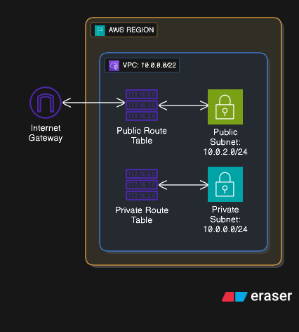

## LAB 14: Create Subnet

### Langkah 1: Buat Private Subnet

1. Pergi ke "Subnet" dalam dashboard VPC
2. Click "Create Subnet" dan isikan nama: `private-subnet`
3. Pastikan pilih VPC: `my-vpc`
4. Pilih Availability Zone (ap-southeast-1a)
5. Isikan IPv4 CIDR block dengan nilai ini: `10.0.0.0/24`
6. Pergi ke "Route Tables" dalam dashboard VPC
7. Click `private-rt` dan pergi ke "Subnet associations"
8. Click "Edit explicit subnet associations"
9. Tick `private-subnet` dan Click "Save associations"

### Langkah 2: Buat Public Subnet

1. Pergi ke "Subnet" dalam dashboard VPC
2. Click "Create Subnet" dan isikan nama: `public-subnet`
3. Pastikan pilih VPC: `my-vpc`
4. Pilih Availability Zone (ap-southeast-1a)
5. Isikan IPv4 CIDR block dengan nilai ini: `10.0.2.0/24`
6. Pergi ke "Route Tables" dalam dashboard VPC
7. Click `public-rt` dan pergi ke "Subnet associations"
8. Click "Edit explicit subnet associations"
9. Tick `public-subnet` dan Click "Save associations"

### Langkah 3: Sahkan di VPC Resource Map

1. Click "Your VPC" dan pilih VPC anda: `my-vpc`
2. Rujuk "Resource Map" dan pastikan ia mengandungi dua subnet anda
